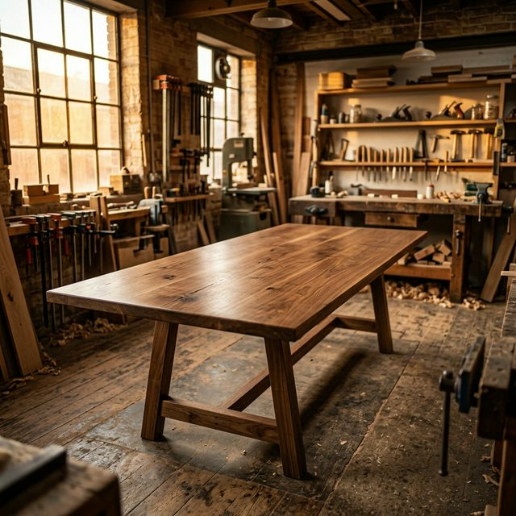

# Sanjay Kumar — Custom Made Furniture Portfolio

A premium, highly interactive portfolio website for a master furniture maker, built to emulate the tactile, sophisticated feel of a luxury editorial magazine. The site features buttery-smooth scrolling, complex scroll-triggered animations, and a rich, earthy art direction.



## 📌 Live Demo
*(Add your Vercel/Netlify live link here once deployed)*

## ✨ Key Features
- **Cinematic Hero Entry**: Dynamic scale-down image reveal paired with staggered GSAP `SplitText` typography animations.
- **Buttery Smooth Scrolling**: Powered by [Lenis](https://lenis.studiofreight.com/), tightly integrated with GSAP's ticker for perfectly synchronized scroll effects.
- **Advanced GSAP Animations**:
  - Scroll-triggered text line reveals (`y: 40`, `opacity: 0` to `1`).
  - Organic `clip-path` image unmasking with subtle inner image parallax (scrubbing).
  - Pinned horizontal scroll section (The Five Stages of Making).
- **Premium UI Interactions**: 
  - Dynamic narrative layouts with intentional negative space.
  - Hover-sweep "magnetic-style" pill buttons with smooth text-roll effects.
  - Asymmetric masonry-style gallery grid.
- **Custom Art Direction**: Warm off-white (`#EFECE6`) and deep charcoal (`#1C1B1A`) palette, pairing classic serifs (`Cormorant Garamond`) with modern sans-serifs (`Inter`).

## 🛠 Tech Stack
- **Framework**: [React 18](https://react.dev/) + [Vite](https://vitejs.dev/)
- **Styling**: Pure, modular Vanilla CSS (CSS Variables, Flexbox, CSS Grid)
- **Animation Engine**: [GSAP](https://gsap.com/) (ScrollTrigger, SplitText, @gsap/react)
- **Smooth Scroll**: [Lenis](https://github.com/studio-freight/lenis)

## 🚀 Getting Started

### Prerequisites
Make sure you have Node.js (v18+) and npm installed on your machine.

### Installation
1. Clone the repository:
   ```bash
   git clone https://github.com/Alok-Chandra108/furniture-gallery.git
   cd furniture-gallery
   ```
2. Install dependencies:
   ```bash
   npm install
   ```
3. Start the development server:
   ```bash
   npm run dev
   ```
   The site will be running at `http://localhost:5173` (or the port specified in your terminal).

## 📁 Project Structure

```text
├── public/
│   └── images/              # AI-generated high-res furniture photography
├── src/
│   ├── components/          # Modular React components for each page section
│   │   ├── Collection.jsx
│   │   ├── Contact.jsx
│   │   ├── Gallery.jsx
│   │   ├── Hero.jsx
│   │   ├── MagneticButton.jsx
│   │   ├── Manifesto.jsx
│   │   ├── Navbar.jsx
│   │   ├── Process.jsx
│   │   └── Testimonial.jsx
│   ├── styles/              # Component-specific CSS modules
│   ├── App.jsx              # Main assembly and global Lenis/GSAP context
│   └── main.jsx             # React DOM entry point
├── index.html               # HTML entry with Open Graph tags and custom SVG favicon
└── vite.config.js           # Vite configuration
```

## 🎨 Design System
- **Colors**:
  - Background (Primary): `#EFECE6` (Warm off-white)
  - Foreground (Primary): `#1C1B1A` (Deep charcoal)
  - Accents: `#8B5A2B` (Timber brown), `#FAFAF8` (Pure contrast)
- **Typography**:
  - Headings: `Cormorant Garamond` (Elegant, high-contrast serif)
  - Body/UI: `Inter` (Clean, legible sans-serif)

## 📝 License
This project is open-source and available under the [MIT License](LICENSE).
